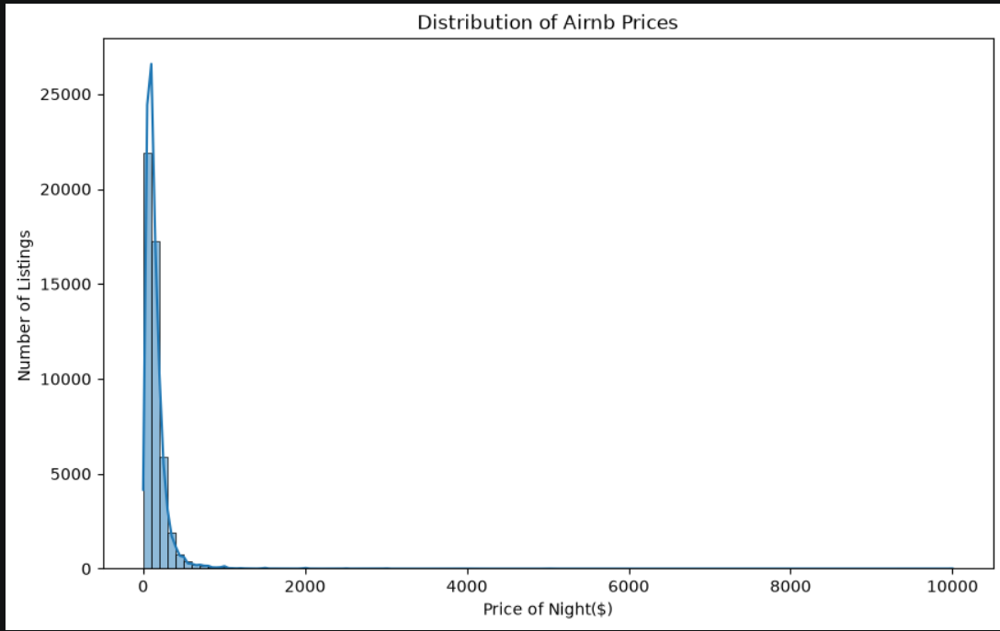
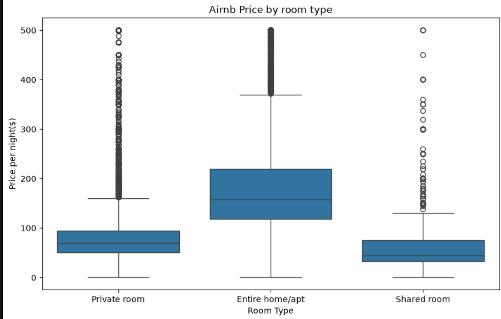
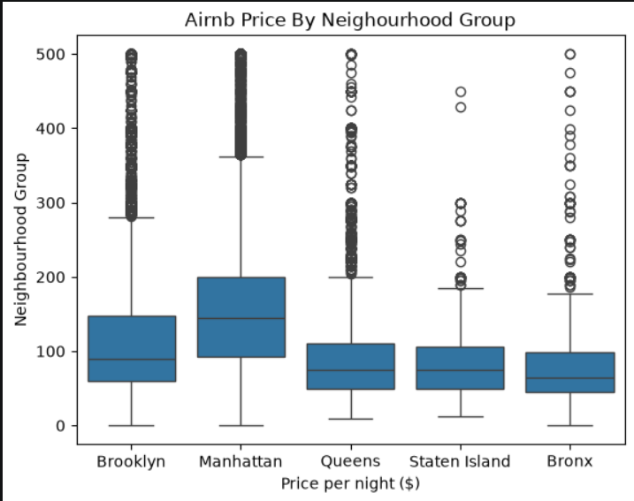
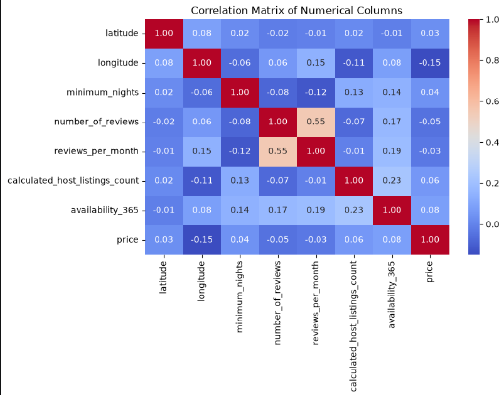
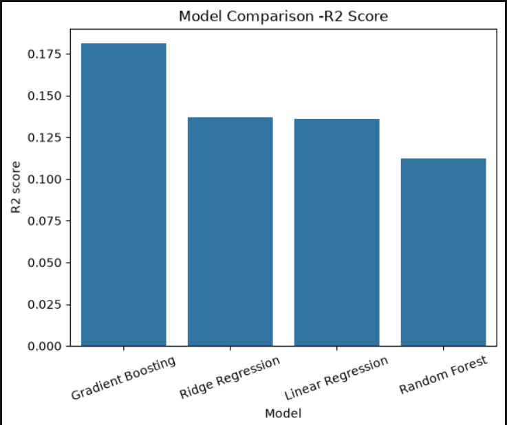
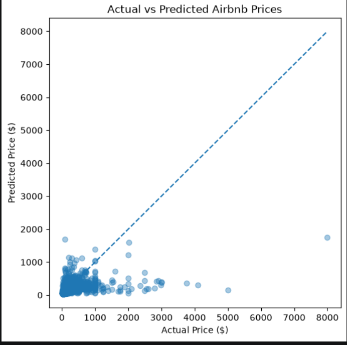

Name:-**Vedant Kapur**

ID: 202618061

Program:- M.Sc. Data Science

This project was developed as part of the Machine Learning laboratory coursework.


# 🏠 NYC Airbnb Price Prediction

## 📌 Project Overview

This project develops an end-to-end machine learning system for predicting the nightly price of Airbnb listings in New York City.

The project uses the **New York City Airbnb Open Data (`AB_NYC_2019.csv`)** dataset and covers the complete machine learning workflow:

**Data Analysis → Data Cleaning → Feature Engineering → Preprocessing → Model Training → Model Comparison → Hyperparameter Tuning → Evaluation → Model Saving → Web Application**

A Streamlit application is also developed to allow users to enter Airbnb listing information and receive an estimated nightly price.

---

## 🎯 Objective

The primary objective of this project is to build a regression-based machine learning model capable of estimating the nightly price of an Airbnb listing based on information such as:

* Location
* Neighbourhood
* Room type
* Geographic coordinates
* Minimum number of nights
* Number of reviews
* Reviews per month
* Host listing count
* Availability throughout the year

The final trained model is integrated into a Streamlit web application.

---

## 📊 Dataset

The project uses the **New York City Airbnb Open Data** dataset:

`AB_NYC_2019.csv`

The dataset contains Airbnb listing information from New York City, including information about hosts, locations, room types, prices, reviews, and availability.

### Target Variable

The target variable is:

```text
price
```

The task is therefore a **supervised regression problem**.

---

## 🔄 Project Workflow

```text
Raw Dataset
     ↓
Data Inspection
     ↓
Data Cleaning
     ↓
Exploratory Data Analysis
     ↓
Feature Engineering
     ↓
Feature Selection
     ↓
Train-Test Split
     ↓
Preprocessing Pipeline
     ↓
Regression Models
     ↓
Model Comparison
     ↓
Hyperparameter Tuning
     ↓
Final Model Evaluation
     ↓
Save Trained Pipeline
     ↓
Streamlit Application
```

---

## 🧹 Data Preparation

The following preprocessing and cleaning operations were performed:

* Checked dataset dimensions and data types.
* Checked for duplicate records.
* Analyzed missing values.
* Removed unnecessary identifier/free-text fields from the initial predictive model.
* Handled missing 'reviews_per_month' values.
* Removed records with invalid non-positive prices.
* Investigated extreme price values and potential outliers.
* Examined numerical and categorical feature distributions.

### Removed Columns

The following columns were excluded from the initial predictive model:

```text
id
name
host_name
last_review
```

These columns were excluded because they either function primarily as identifiers, contain free-text information requiring additional NLP processing, or were not considered essential for the basic price prediction workflow.

---
## 🧠 Machine Learning Models

Several regression algorithms were trained and compared:

1. Linear Regression
2. Ridge Regression
3. Random Forest Regressor
4. Gradient Boosting Regressor

The models were implemented using Scikit-learn pipelines so that preprocessing and prediction could be performed consistently.

---

## ⚙️ Preprocessing

A Scikit-learn `ColumnTransformer` was used to apply different preprocessing operations to numerical and categorical features.

### Numerical Features

Numerical preprocessing includes:

* Median imputation for missing values
* Standard scaling

### Categorical Features

Categorical preprocessing includes:

* Most-frequent-value imputation
* One-hot encoding
* Handling of previously unseen categories

This preprocessing is included within the machine learning pipeline to prevent inconsistencies between model training and application predictions.

---

## 📈 Evaluation Metrics

The regression models were evaluated using:

### Mean Absolute Error (MAE)

Measures the average absolute difference between actual and predicted prices.

Lower values indicate better performance.

### Root Mean Squared Error (RMSE)

Penalizes larger prediction errors more strongly than MAE.

Lower values indicate better performance.

### R² Score

Measures the proportion of variation in Airbnb prices explained by the model.

Higher values indicate better performance.

---

## 📊 Model Comparison

The final model comparison is shown below.

| Model             | MAE | RMSE |  R2 Score |
| ----------------- | --: | ---: | --: |
| Linear Regression | 70.69 | 185.98 | 0.14 |
| Ridge Regression  | 70.60 | 185.89  | 0.14 |
| Random Forest     | 64.69 | 188.51 | 0.11 |
| Gradient Boosting | 65.93 | 181.06 | 0.18 |
| Tuned Final Model | 62.35 | 174.37 | 0.24 |

---

## 🔍 Overfitting Analysis

Training and testing performance were compared to identify potential overfitting or underfitting.

The difference between training and testing R² scores was examined.

A large performance gap indicates that a model may be overfitting the training data, while similar training and testing performance suggests better generalization.

---

## 🎯 Hyperparameter Tuning

The best-performing candidate model was further optimized using `RandomizedSearchCV`.

For the Random Forest model, parameters such as the following were explored:

```text
n_estimators
max_depth
min_samples_split
min_samples_leaf
max_features
```

Cross-validation was used during hyperparameter search to obtain a more reliable estimate of model performance.

---

## 💾 Saved Model

The final preprocessing and trained model are saved together as:

```text
airbnb_price_pipeline.pkl
```

The saved pipeline contains:

```text
Preprocessing
     +
Feature Transformation
     +
Trained Regression Model
```

This allows the Streamlit application to use the same preprocessing workflow that was used during model training.

---

## 🌐 Streamlit Application

A Streamlit web application was developed to provide a simple interface for Airbnb price prediction.

The application accepts listing information such as:

* Neighbourhood group
* Neighbourhood
* Room type
* Latitude
* Longitude
* Minimum nights
* Number of reviews
* Reviews per month
* Host listing count
* Availability

The application then returns the estimated nightly Airbnb price.

### Run the Application

Install the required packages:

```bash
pip install -r requirements.txt
```

Then run:

```bash
streamlit run app.py
```

The application will open in a local browser.

---

## 📷 Project Screenshots

### Price Distribution



### Price by Room Type



### Price by Neighbourhood



### Correlation Matrix



### Model Comparison



### Actual vs Predicted Prices



### Streamlit Application


---

## 🛠️ Technologies Used

* Python
* Pandas
* NumPy
* Matplotlib
* Seaborn
* Scikit-learn
* Joblib
* Streamlit
* Jupyter Notebook

---

## ⚠️ Limitations

The model has several limitations:

* Airbnb prices can vary significantly depending on season and local demand.
* The dataset does not contain detailed information about amenities and property quality.
* Listing descriptions and photographs were not incorporated.
* External factors such as holidays, events, and tourism demand are not directly modeled.
* Geographic features provide location information but may not capture every neighbourhood-level pricing factor.
* Predictions should therefore be treated as estimates rather than exact market prices.

---

## 🚀 Future Improvements

Possible improvements include:

* Incorporating Airbnb amenities.
* Applying natural language processing to listing descriptions.
* Adding seasonal and temporal features.
* Incorporating external tourism and event data.
* Experimenting with advanced boosting algorithms.
* Developing a more detailed geographical feature representation.
* Deploying the Streamlit application online.

---

